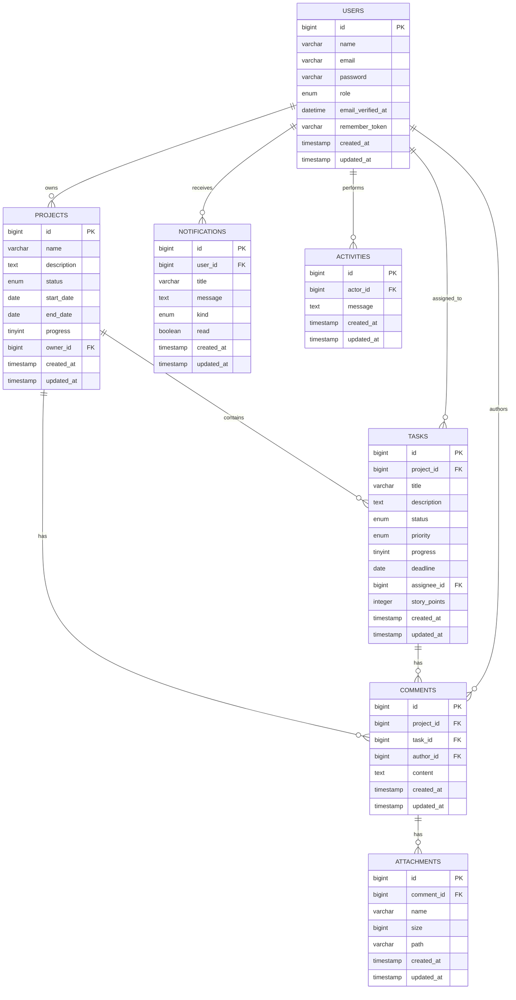
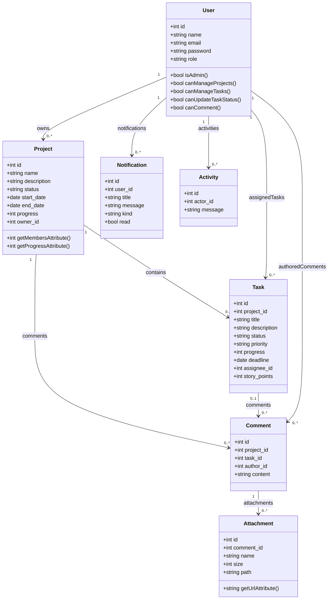

# Architecture Diagrams

Dokumentasi ini mencakup ERD, Use Case, dan Class Diagram berdasarkan backend `be-project-management`.

## 1. Entity Relationship Diagram (ERD)

Representasi entitas dan relasi utama:

- `users`
- `projects`
- `tasks`
- `comments`
- `attachments`
- `notifications`
- `activities`



## 2. Use Case Diagram

Aktor dan skenario utama berdasarkan API `routes/api.php` dan kontroler backend.

Aktor:
- Guest
- Authenticated User
- Team Member
- Project Manager
- Admin

Use case utama:
- Register
- Login
- Logout
- View profile
- View projects
- Create/update/delete projects
- Create/update/delete tasks
- Comment on projects/tasks
- View notifications
- Mark notifications read
- View activity feed
- Manage users (Admin only)

```mermaid
flowchart TB
    Guest[Guest]
    AuthUser[Authenticated User]
    TeamMember[Team Member]
    ProjectManager[Project Manager]
    Admin[Admin]

    UC_Register[[Register]]
    UC_Login[[Login]]
    UC_Logout[[Logout]]
    UC_ViewProfile[[View Profile]]
    UC_ViewProjects[[View Projects]]
    UC_ManageProjects[[Manage Projects]]
    UC_ManageTasks[[Manage Tasks]]
    UC_Comment[[Comment on Project/Task]]
    UC_ViewNotifications[[View Notifications]]
    UC_MarkNotificationsRead[[Mark Notifications Read]]
    UC_ViewActivities[[View Activity Feed]]
    UC_ManageUsers[[Manage Users]]

    Guest --> UC_Register
    Guest --> UC_Login
    AuthUser --> UC_Logout
    AuthUser --> UC_ViewProfile
    AuthUser --> UC_ViewProjects
    AuthUser --> UC_ViewActivities
    AuthUser --> UC_ViewNotifications
    TeamMember --> UC_ManageTasks
    TeamMember --> UC_Comment
    ProjectManager --> UC_ManageProjects
    ProjectManager --> UC_ManageTasks
    ProjectManager --> UC_Comment
    Admin --> UC_ManageUsers
    Admin --> UC_ManageProjects
    Admin --> UC_ManageTasks
    Admin --> UC_Comment
```



## 3. Class Diagram

Model domain utama dan relasi antar kelas.



@enduml
```

## Catatan

- `comments` selalu terkait ke `project`; dapat juga terkait ke `task`.
- `tasks` dapat memiliki `assignee_id` nullable untuk tugas yang belum ditetapkan.
- `notifications` dibatasi kepada pengguna tertentu.
- `activities` mencatat tindakan dengan `actor_id` ke `users`.

Untuk merender diagram, gunakan ekstensi PlantUML atau generator PlantUML pada file Markdown ini.
